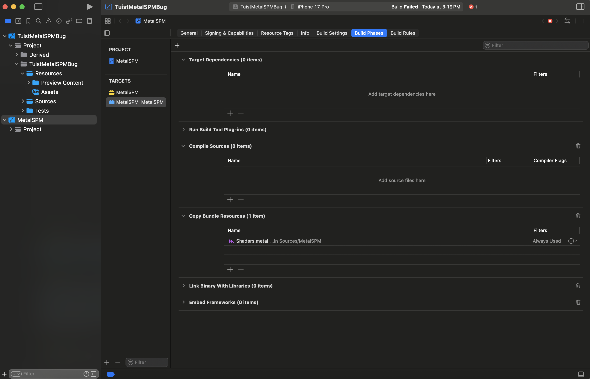
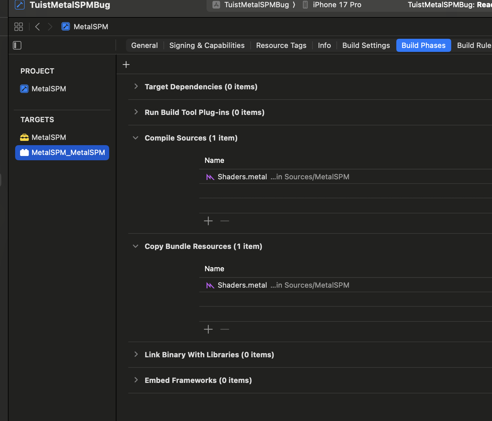
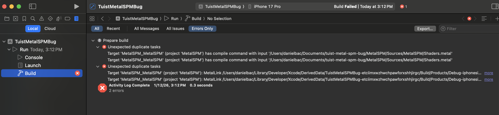

# Tuist Metal SPM Bug

This repository demonstrates a bug introduced in **Tuist 4.78.1** when adding an external SPM dependency that includes Metal (`.metal`) files as part of its sources.

## Bug Description

When using Tuist 4.78.1 with an external dependency containing Metal shader files, the build fails with duplicate file errors. The issue is that Tuist incorrectly adds the `.metal` file as a compiled source in addition to the resource bundle, causing duplicated symbol/file conflicts.

### Root Cause

The bug was introduced in [PR #8207](https://github.com/tuist/tuist/pull/8207), specifically in this file change: [[Sources/TuistGenerator/Generator/ProjectFileElements.swift]([https://github.com/tuist/tuist/pull/8207/files#diff-2c4c30a25ed01e55d1e6dd5e07a16c1e02ec6c24a95e0ae9f8c33edb7a0d5e63](https://github.com/tuist/tuist/pull/8207/changes#diff-fd82aca7a4046536b40e4923717b57aa7d9b94763a1ec03805753747fdd6a38aR80))](https://github.com/tuist/tuist/pull/8207/changes#diff-fd82aca7a4046536b40e4923717b57aa7d9b94763a1ec03805753747fdd6a38aR80).

This PR changed how Metal files are handled when generating the Xcode project, causing them to be added as compiled sources when they should only be included as resources (as defined in the SPM `Package.swift`).

## Environment

- **Affected Version:** Tuist 4.78.1
- **Working Version:** Tuist 4.78.0
- **Platforms:** iOS 17+, macOS 14+

## Reproduction Steps

### Prerequisites

1. Clone this repository
2. Ensure [mise](https://mise.jdx.dev/) is installed

### Reproduce the Bug (Tuist 4.78.1)

```bash
# Verify Tuist version (should be 4.78.1)
tuist version

# Install dependencies
tuist install

# Generate the project
tuist generate

# Try to build the app - you will see duplicate files error
# Build via Xcode or: xcodebuild -workspace TuistMetalSPMBug.xcworkspace -scheme TuistMetalSPMBug -destination 'platform=iOS Simulator,name=iPhone 15'
```

**Expected Result:** Build fails with duplicate file errors.

### Workaround (Using Pure SPM)

```bash
# Generate using pure SPM integration (bypasses the bug)
TUIST_SPM=true tuist generate

# Build the app - it should succeed
```

The difference is in how the dependency is declared in `Project.swift`:
- **Bug path:** Uses `.external(name: "MetalSPM")` - Tuist processes the dependency
- **Workaround:** Uses `.package(product: "MetalSPM")` - Pure SPM, Tuist doesn't interfere

### Verify regression does not happen on 4.78.0

```bash
# Edit mise.toml and change tuist version to "4.78.0"
# Then:
tuist clean
tuist install
tuist generate

# Build the app - it should succeed
```

## Project Structure

```
├── MetalSPM/                    # SPM Package with Metal shaders
│   ├── Package.swift            # Defines .metal as resource
│   └── Sources/MetalSPM/
│       ├── Shaders.metal        # Metal shader file
│       └── include/Shaders.h
├── Tuist/
│   └── Package.swift            # External dependency declaration
├── TuistMetalSPMBug/            # Main app target
├── Project.swift                # Tuist project config (see TUIST_SPM toggle)
└── mise.toml                    # Tuist version pinning
```

## Visual Evidence

### Bundle Comparison

| Tuist 4.78.0 (Working) | Tuist 4.78.1 (Broken) |
|------------------------|------------------------|
|  |  |

In **4.78.0**, the Metal file is correctly included only in the resource bundle.

In **4.78.1**, the Metal file is incorrectly added as a compiled source in the "Compile Sources" build phase, in addition to being in the resource bundle. This causes the duplication error.

### Build Error (4.78.1)



The build error shows duplicate file conflicts caused by the Metal shader being processed twice.

## MetalSPM Package Configuration

The SPM package correctly defines the Metal file as a resource:

```swift
// MetalSPM/Package.swift
.target(
    name: "MetalSPM",
    resources: [
        .process("Shaders.metal")  // ← Defined as resource, not compiled source
    ]
)
```

When using pure SPM or Tuist 4.78.0, this is respected. In Tuist 4.78.1, the generator incorrectly also adds it to compiled sources.

## Related Links

- **Bug-introducing PR:** [tuist/tuist#8207](https://github.com/tuist/tuist/pull/8207)
- **Specific file change:** [[ProjectFileElements.swift diff](https://github.com/tuist/tuist/pull/8207/files#diff-2c4c30a25ed01e55d1e6dd5e07a16c1e02ec6c24a95e0ae9f8c33edb7a0d5e63)](https://github.com/tuist/tuist/pull/8207/changes#diff-fd82aca7a4046536b40e4923717b57aa7d9b94763a1ec03805753747fdd6a38aR80)

